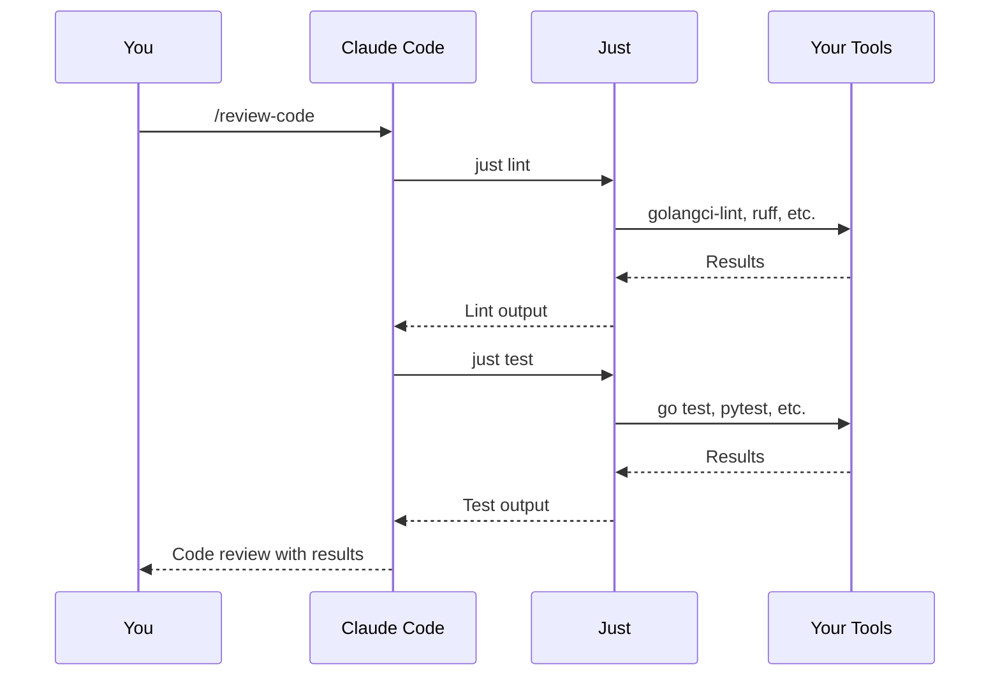

# Claude Dotfiles

**Supercharge Claude Code with Just task runner integration.**

This repository provides:
- Shared Just recipes for consistent linting and testing across projects
- Claude Code slash commands that run Just tasks and generate structured outputs
- Git hooks that enforce quality standards via Just validation

## Why This Exists

**Problem**: Every project has different commands for linting, testing, and validation. Claude Code can't know if it's `npm test`, `pytest`, `go test`, etc.

**Solution**: Define a common protocol using Just recipes. Claude uses slash commands that call `just` tasks, which you implement for your project's specific tools.

**Value**: Claude Code can now `/review-code` (runs `just lint` + `just test`), `/plan` features, and `/commit` with proper validation - regardless of your tech stack.

## How It Works

1. You define `lint` and `test` recipes in your project's `justfile`
2. Claude's slash commands call standardized Just recipes
3. Git hooks run `just validate` before commits
4. Desktop notifications alert you when Claude awaits input
5. Everything works together seamlessly



## Quick Start

### 1. Install Prerequisites

**Just** (command runner):
```bash
# macOS
brew install just

# Linux
curl --proto '=https' --tlsv1.2 -sSf https://just.systems/install.sh | bash -s -- --to /usr/local/bin

# Windows (via Scoop)
scoop install just
```

**Git** (you probably have this):
```bash
git --version
```

### 2. Clone This Repository

```bash
git clone https://github.com/YOUR_USERNAME/claude-dotfiles ~/.claude-dotfiles
```

### 3. Set Up in Your Project

```bash
cd your-project
~/.claude-dotfiles/install.sh
```

This creates:
- `justfile` - Imports shared recipes from `~/.claude-dotfiles/justfiles/`
- `.claude/` directory in your project (for plans and local customization)
- Git hooks that run `just validate` before commits
- Symlinks `~/.claude-dotfiles/commands/` → `~/.claude/commands/` (global Claude Code integration)

### 4. Configure Your Project

Edit `justfile` to implement required recipes:

```just
# Import base protocol
import? '~/.claude-dotfiles/justfiles/_base.just'

# REQUIRED: Implement lint and test or validation will fail
lint:
  golangci-lint run ./...
  ruff check .

test:
  go test -race -cover ./...
  pytest -v

# See examples/justfiles/ for more recipe ideas
```

### 5. Start Using!

**Just commands:**
```bash
just --list        # See available commands
just validate      # Run lint + test (will fail until configured)
just info          # Display repository information and status
```

**Claude Code slash commands (available immediately):**
```
/plan <feature>        # Create implementation plan
/review-code           # Review staged changes
/review-plan <file>    # Review a plan file
/commit                # Generate commit message
/prepare-pr            # Prepare branch for PR with linear history
/just-help             # Get help with Just
```

## Features

### Just Recipes

All development tasks go through Just for consistency:

```bash
just validate       # Run lint + test
just lint           # Run linters (must be implemented)
just test           # Run tests (must be implemented)
just info           # Display repository information and status
```

The `lint` and `test` recipes are **required** - you define what tools to run for your project.

### Slash Commands

Built-in commands for Claude Code workflows:

- **/plan** - Create structured implementation plans
- **/review-code** - Review staged changes with automated checks
- **/review-plan** - Review implementation plans for completeness
- **/commit** - Generate conventional commit messages
- **/prepare-pr** - Prepare feature branch for PR with linear history workflow
- **/just-help** - Get help with Just recipes and usage

Commands are immediately available after installation in `.claude/commands/`.

### Prompt Templates

Structured templates for consistent outputs:

- `plan.md` - Implementation plan format
- `review-code.md` - Code review format
- `review-plan.md` - Plan review format
- `commit.md` - Commit message format

Customize in `.claude/prompts/` for your team.

### Git Hooks

**pre-commit** - Runs `just validate` before every commit:
```bash
git commit  # ← Automatically validates
```

**prepare-commit-msg** (optional) - Generates commit messages:
```bash
# Enable once:
chmod +x .git/hooks/prepare-commit-msg

# Then commit normally - message is generated:
git commit
```

### Notification Hooks

Get desktop notifications when Claude Code is waiting for your input:

**Linux (automatic setup):**
```bash
~/.claude-dotfiles/scripts/install-notification-hooks.sh
```

**macOS (manual setup - scoped):**
Follow the instructions in [docs/notification-hooks.md](docs/notification-hooks.md) to configure osascript-based notifications.

**Features:**
- Desktop alerts when Claude awaits input
- Project context in notifications (tmux window, git repo name)
- Sound alerts (customizable)
- Auto-dismiss notifications
- Works with multiple Claude sessions

See [docs/notification-hooks.md](docs/notification-hooks.md) for full documentation and customization options.

## Common Workflows

### Planning a Feature

```
In Claude: /plan add rate limiting to API
```

Claude runs `just info` to understand your project, asks clarifying questions, then generates a structured plan saved to `.claude/plans/`.

### Reviewing Code

```bash
git add .
```

```
In Claude: /review-code
```

Claude runs `just lint` and `just test`, reviews your `git diff`, and provides feedback on code quality, test coverage, and potential issues.

### Committing Changes

```
In Claude: /commit
```

Claude analyzes your staged changes and generates a conventional commit message. Copy and use it, or enable the `prepare-commit-msg` hook to auto-generate.

See [examples/workflows.md](examples/workflows.md) for more.

## Git Workflow: Linear History

**This repository enforces a strict linear history workflow** for clean, maintainable git history.

### Quick Overview

Before creating a PR, you must:
1. **Rebase and squash** commits into single or discrete working commits
2. **Pull latest main** branch
3. **Rebase onto main** to ensure linear history
4. **Force push** your branch

### Using the Workflow

**Automated (recommended):**
```bash
./scripts/git-linear-history.sh
```

**Manual:**
```bash
git rebase -i $(git merge-base HEAD main)  # Squash commits
git fetch origin main                       # Get latest main
git rebase origin/main                      # Rebase onto main
git push origin BRANCH --force-with-lease   # Force push
```

**Via Claude:**
```
/prepare-pr

Claude will guide you through the linear history workflow
```

### Why Linear History?

- **Easier code review** - Each commit represents a complete change
- **Better bisect** - Every commit is working and testable
- **Cleaner history** - No "fix typo" or merge commits
- **Simpler reverts** - Revert entire features with one command

See [docs/git-workflow.md](docs/git-workflow.md) for detailed documentation.

## Customization

### Per-Repository

**justfile** - Add repo-specific recipes:
```just
deploy-staging:
  kubectl apply -f k8s/ --context=staging
```

**context.yaml** - Add project context:
```yaml
project:
  name: "Payment API"

conventions:
  commit_scopes:
    - payment
    - stripe
```

**prompts/** - Customize templates:
```bash
cp .claude/prompts/plan.md .claude/prompts/plan-custom.md
# Edit to match your team's style
```

### Team-Wide

Fork this repository and add:
- Custom skills in `skills/team/`
- Team-specific Just recipes
- Company commit conventions
- Internal tool integrations

## Directory Structure

**Global installation** (symlinked to ~/.claude for Claude Code):
```
~/.claude-dotfiles/          # Cloned repository
├── commands/                # Symlinked to ~/.claude/commands/
│   ├── plan.md
│   ├── review-code.md
│   └── commit.md
├── justfiles/               # Shared Just recipes
│   ├── _base.just          # Core: validate, info, check-clean
│   └── plans.just          # Plan & worktree management
├── hooks/                   # Git hook templates
├── prompts/                 # Output format templates
├── skills/                  # AI skill guides
└── install.sh
```

**Per-project** (created by install.sh):
```
your-project/
├── justfile                 # Imports ~/.claude-dotfiles/justfiles/_base.just
├── .claude/
│   ├── plans/              # Generated plans stored here
│   └── context.yaml        # Optional project context
└── .git/hooks/
    └── pre-commit          # Runs just validate
```

**How Claude Code finds commands**: Reads from `~/.claude/commands/` (symlinked from repo)

## Requirements

- **Just** - Command runner ([install](https://just.systems))
- **Git** - Version control
- **Claude Code** - AI-powered coding assistant ([docs](https://docs.claude.com/claude-code))

Language-specific (optional):
- **golangci-lint** - For Go projects
- **ruff** - For Python projects
- **terraform** + **tflint** + **tfsec** - For Terraform projects
- **kustomize** + **kubectl** + **kubeconform** - For Kubernetes/Kustomize projects
- **yamllint** - For YAML validation

## Troubleshooting

### "just: command not found"

Install Just: https://just.systems

### "Recipe not found"

Check available recipes:
```bash
just --list
```

Make sure imports in your justfile are uncommented.

### Validation failing

See what's failing:
```bash
just lint  # Check linting
just test  # Check tests
```

Fix issues and try again.

### Hook not running

Check hook is executable:
```bash
ls -la .git/hooks/pre-commit
```

Should show: `-rwxr-xr-x` (the `x` means executable)

If not:
```bash
chmod +x .git/hooks/pre-commit
```

### Slash commands not working

Slash commands are automatically available in Claude Code after installation. They are located in `.claude/commands/`. If commands aren't recognized, ensure you're using Claude Code (not claude.ai) and the `.claude/commands/` directory exists in your project.

## Documentation

- **[Git Workflow](docs/git-workflow.md)** - Linear history workflow with rebase and squash
- **[Python Style Guide](docs/python-style-guide.md)** - Comprehensive Python coding standards
- **[Terraform Style Guide](docs/terraform-style-guide.md)** - Comprehensive Terraform coding standards and tooling
- **[Kustomize Style Guide](docs/kustomize-style-guide.md)** - Comprehensive Kustomize coding standards and patterns
- **[Notification Hooks](docs/notification-hooks.md)** - Desktop notifications setup and configuration
- **[Contributing](CONTRIBUTING.md)** - Development setup and guidelines
- **[Testing](TESTING.md)** - Testing procedures and validation
- **[Workflows](examples/workflows.md)** - Example workflows with Claude

## Contributing

See [CONTRIBUTING.md](CONTRIBUTING.md) for development setup and guidelines.

## License

MIT License - see [LICENSE](LICENSE) for details

## Support

- Issues: [GitHub Issues](https://github.com/YOUR_USERNAME/claude-dotfiles/issues)
- Discussions: [GitHub Discussions](https://github.com/YOUR_USERNAME/claude-dotfiles/discussions)

## Acknowledgments

Built for platform engineers working with Go, Python, Terraform, and Kubernetes.

Inspired by the power of combining:
- [Just](https://just.systems) - Command runner
- [Claude](https://claude.ai) - AI assistant
- [Conventional Commits](https://www.conventionalcommits.org) - Commit standards
